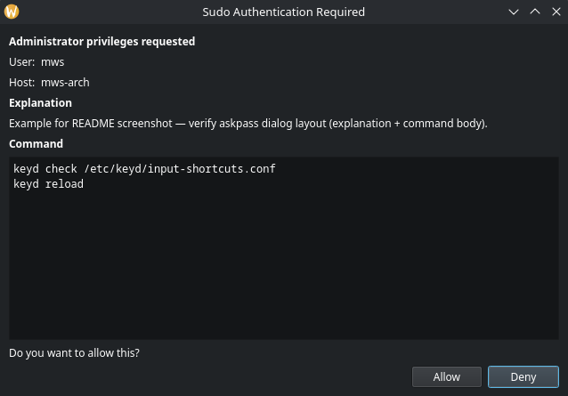

# sudoplz

Give Claude Code, Cursor, and other AI coding agents the ability to run `sudo` — with case-by-case GUI approval, no passwordless sudo, no `/etc/sudoers` allowlists.

Your sudo password is encrypted to your SSH public key and only decrypted after you approve a dialog showing the exact command about to run. Deny the dialog and nothing happens.



## Why

Coding agents can't handle interactive terminal prompts. Ask Claude Code to run `sudo apt install foo` and you get `sudo: Authentication failed`. The common workarounds all have problems:

- **Passwordless sudo** gives the agent — and anything else running as your user — unrestricted root.
- **`/etc/sudoers` allowlists** require predicting every command the agent will ever need. No case-by-case review.
- **Manual copy-paste** is tedious and breaks the agent's flow.

`sudoplz` plugs into `sudo -A`, so the agent runs `sudo -A <command>`, you see a dialog with the exact command, and you click Allow or Deny. Works for any command without pre-declaring what's permitted.

This threat model assumes a personal workstation with an encrypted disk and a passphrase-protected SSH key. Not appropriate for shared or production systems.

## Installation

1. **Use traditional `sudo`, not `sudo-rs`.** `sudo-rs` doesn't support askpass. Check with `sudo --version` — it should say "Sudo version 1.x.x". If you're on `sudo-rs`, switch:
   ```bash
   sudo update-alternatives --install /usr/bin/sudo sudo /usr/bin/sudo.ws 100
   sudo update-alternatives --config sudo   # pick sudo.ws
   ```
2. Make sure you have an Ed25519 or RSA SSH key. ECDSA and DSA keys are not supported.
3. Install system dependencies:
   - [`age`](https://github.com/FiloSottile/age) — required for SSH-backed password storage and TOTP. `sudo pacman -S age` / `sudo apt install age` / `brew install age`.
   - `zenity` on Linux — provides the GUI approval dialog. Pre-installed on most GNOME-based distros; `sudo apt install zenity` if missing. Not needed on macOS (uses AppleScript).
4. Install from PyPI with [`uv`](https://docs.astral.sh/uv/):
   ```bash
   uv tool install sudoplz
   ```
   This puts `askpass` and `sudoplz` on your PATH. (For development: clone the repo and run `uv tool install .` instead.)
5. Point `SUDO_ASKPASS` at the installed binary (add to `~/.bashrc`, `~/.zshrc`, etc.):
   ```bash
   export SUDO_ASKPASS="$(which askpass)"
   ```
6. Store your sudo password:
   ```bash
   sudoplz set
   ```

## Usage

Your agent (or you) runs `sudo -A <command>`. A dialog pops up showing the command. You approve or deny.

```bash
sudo -A apt install foo
```

Gotcha: `sudo -n` explicitly disallows prompting and will never trigger askpass. Always use `-A`.

Test the integration with:

```bash
sudoplz test
```

## Security

### Encryption at rest

New passwords use `age` encryption with an Ed25519 or RSA SSH key. The encrypted
payload, original key path, and creation time are stored together in
`~/.config/sudoplz/credential.json` with 600 permissions. Key preference for new
credentials is Ed25519, then RSA. Adding another key does not change how an
existing credential is decrypted.

Without an SSH key, passwords use the system keyring with creation-time metadata
in the same credential file. A decryption failure never falls back to an older
password. Replacement and clearing retire previous storage; an empty record
prevents legacy credentials from being rediscovered after clearing.

Existing `~/.sudo_askpass.age` and RSA `~/.sudo_askpass.ssh` credentials are imported
on first use, preserving their original modification time. If both exist, the
newest file is selected. Legacy RSA keys can use OpenSSH or PEM format. A legacy
keyring entry has no reliable creation time: run `sudoplz set` again to use it with
expiration enabled. Keep the original SSH key available during migration.

### Defense in depth

Encryption alone doesn't cover every abuse path — anything running as your user can in principle request decryption. The askpass script runs these checks on every invocation; any failure means no decryption:

- **Caller path whitelist.** Only decrypts when the caller's working directory is on an allowlist (home, `/tmp`, etc.). Blocks invocations from unexpected locations like `/var/tmp/malicious`.
- **Caller process whitelist.** Parent process must be on an allowlist (sudo, your shell, your IDE, your deploy tool). Keeps arbitrary binaries from invoking askpass directly.
- **User confirmation.** A GUI dialog asks for approval on each decryption, so any sudo elevation you didn't initiate is visible and can be denied.
- **Rate limiting.** Configurable max-attempts-per-hour and lockout window. Contains runaway scripts and brute-force attempts.
- **Password expiration.** Retrieval is refused after the configured age (default: 1 week), including keyring credentials. Expiration does not destroy stored data or revoke stolen copies; use `sudoplz clear` to remove stored credentials.

Configure these in `~/.config/sudoplz/config.json` — an example is shipped as `askpass-config.json` in the repo; copy it and edit. Unknown settings, invalid types, and invalid ranges are rejected; malformed policy never silently falls back to defaults.

### Why age for Ed25519?

Ed25519 is a signing algorithm (EdDSA), not encryption. OpenSSL handles RSA encryption directly, but Ed25519 keys can't do asymmetric encryption at all. `age` was designed to work with SSH keys including Ed25519.

### SSH key unlocking

Passphrase-protected SSH keys are unlocked in memory using `cryptography[ssh]`.
Askpass requests the passphrase through a hidden GUI prompt, or a hidden terminal
prompt in headless sessions. The decrypted identity is piped to age; it is never
written to a temporary key file or placed in command arguments.

Unlocking is per invocation. When TOTP and the password use the same identity,
askpass prompts once during that invocation. There is no session-wide passphrase
cache and no ssh-agent requirement: [age does not support ssh-agent](https://github.com/FiloSottile/age#ssh-keys).
A fully non-interactive session cannot unlock a passphrase-protected key. Supplying
`TOTP` authorizes the request but does not unlock the SSH key.

## Commands

```bash
sudoplz set        # Store password (terminal prompt; expires per config, 1 week default)
sudoplz set-totp   # Store password with TOTP verification (headless)
sudoplz totp-setup # Set up TOTP for headless sessions
sudoplz get        # Check if password exists
sudoplz clear      # Remove password
sudoplz test       # Test sudo integration
sudoplz config --show  # View validated policy
sudoplz audit      # Show recent askpass usage
```

## Headless/SSH usage with TOTP

For servers or SSH sessions without a display, authenticate with TOTP.

### Initial setup (run once from a GUI session)

```bash
sudoplz totp-setup
```

Prints a TOTP secret and an `otpauth://` URL to add to your authenticator app.

### Setting a password from a headless session

```bash
sudoplz set-totp
```

Enter your 6-digit TOTP code, then your password.

### Using sudo with TOTP

When `DISPLAY` isn't set, askpass prompts for a TOTP code:

```bash
# Interactive — prompts for TOTP code
sudo -A command

# Non-interactive — pass TOTP via environment
TOTP="123456" sudo -A command
```

## Development checks

Install `age`, `ssh-keygen`, and `openssl`, then run:

```bash
uv run --group dev ruff check .
uv run --group dev mypy src
uv run python -m unittest discover -s tests -v
```

Tests use temporary SSH keys, dummy credentials, and an in-memory keyring.

## Credits

The idea — an SSH-key-encrypted sudo password served via `SUDO_ASKPASS`, gated by a confirmation dialog — is from [GlassOnTin/secure-askpass](https://github.com/GlassOnTin/secure-askpass). That project is dormant; `sudoplz` is a substantially rewritten and cleaned up fork. Thanks to [@GlassOnTin](https://github.com/GlassOnTin) for the original idea.

## License

MIT — see LICENSE.
